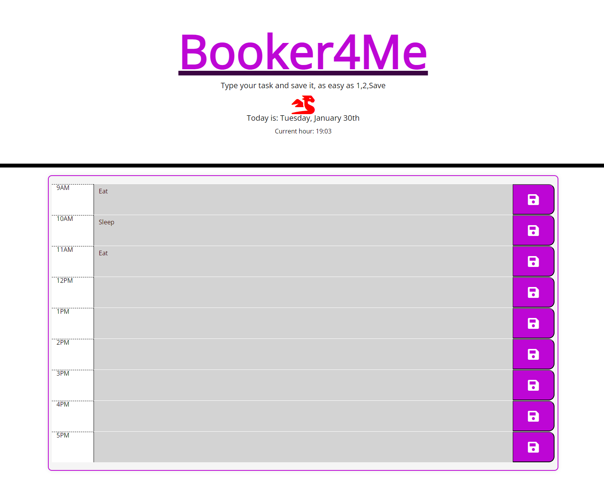

# Work-Booking-Screen
A page to add tasks to a workday schedule split by hours

## Table of Contents
Project description
Link to deployed application
Overview 
Installation
Usage
Credits
License

## Project Description
This project is a workday scheduler that allows the user to add tasks to a workday schedule split by hours. The user can also save their schedule to local storage so that they can access it later.

## Link to Deployed Application: https://dodoid.github.io/Work-Booking-Screen/ 

## Overview
This project uses jQuery to dynamically create the workday schedule and local storage to save the user's schedule. The user can also delete tasks from the schedule.

## Installation
No installation is required.

## Usage
The user can add tasks to the schedule by typing in the task and clicking the save button. The user can also delete tasks from the schedule by clicking the delete button. The user can also clear the schedule by clicking the clear button.

## Credits
Daniel D

## License
MIT License 

Copyright (c) [2024] [<Daniel D>]
